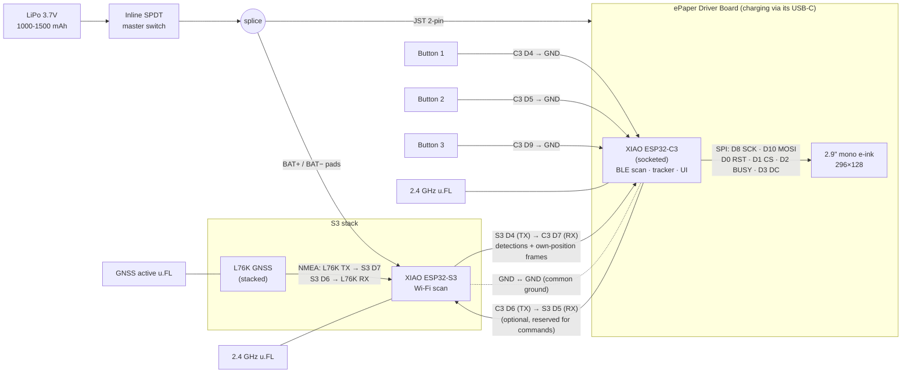

# Architecture

## Context

dump3411 is a pure-Python (3.10+) Remote ID drone detector built for a Raspberry Pi Zero W: it decodes ASTM F3411/OpenDroneID broadcasts over Bluetooth LE (via `bleak`/BlueZ) and Wi-Fi Beacon/NAN (via a raw-socket monitor-mode USB adapter), tracks currently-airborne drones, and serves a dashboard/JSON feed/MQTT stream. This project's goal is a portable, battery-powered version — a handheld unit good for a few hours of use between recharges, not an unattended field post.

No SDR/DSP is involved anywhere in dump3411's code — both radio paths receive already-demodulated frames from the host's radio hardware and do byte/bitfield parsing on top. That's the good news for portability: the *algorithm* is small and simple. The bad news is that essentially the entire "wire it up to the OS" layer — BlueZ/D-Bus, `AF_PACKET` raw sockets, `iw`/NetworkManager/`rfkill` shell-outs, systemd/journald, `sqlite3`-on-a-real-filesystem — is Linux-specific and has no equivalent in an RTOS/bare-metal target. **This is a from-scratch C/C++ rewrite against ESP-IDF, not a literal port of the Python.** The parsing logic itself (Basic ID/Location/System/Operator ID/Self-ID message decoding in dump3411's `ble_feeder.py` and `wifi_feeder.py`) transfers almost mechanically, and can finally be de-duplicated into a single shared decoder — something dump3411's own `TODO.md` already flags as wanted for the Python side too.

This doc documents **two build tiers** rather than committing to one fixed design — pick based on budget and how much detection reliability matters, or start with the shared groundwork and decide later. The reference hardware is the [Seeed XIAO build](#reference-build--seeed-xiao-solo--dual-radio-upgrade-path), which covers both tiers with the same parts.

## Open question: real-world BLE RID prevalence

In testing dump3411 on the Pi, BLE Remote ID detections have not shown up at all — only Wi-Fi. A code read of `ble_feeder.py` didn't turn up an obvious bug: the UUID matching, service-data length handling, and message decode logic all look sound, and the code already logs a warning for any 0xFFFA service data it can't parse (so a total absence of even that warning means the adapter isn't seeing RID service-data advertisements at all, not that it's seeing-and-failing).

That said, **dump3411's BLE receive path has never been validated against spec-compliant hardware** — dump3411's own `TESTING.md` only confirms an expected result for Wi-Fi, and its `TODO.md` has an explicitly unstarted item to validate against a real transmitter (`ArduPilot/ArduRemoteID` on an ESP32-S3, ~$10-15). Two plausible non-bug explanations also exist: DJI (the dominant consumer drone maker) implements Standard Remote ID primarily over Wi-Fi, and BLE Legacy Advertising has meaningfully shorter range than a decent external Wi-Fi adapter — so "Wi-Fi hits, no BLE hits" could just reflect what's actually in the air combined with a range mismatch, not a defect.

**Why this matters here:** dual-radio mode dedicates an entire second board to BLE (RID scan + GATT peripheral for the phone app). If real-world BLE RID prevalence turns out to be genuinely low even with a confirmed-working receiver, that's a legitimate reason to treat BLE as an add-later enhancement rather than a load-bearing v1 assumption, and to prioritize solo/Wi-Fi-first work instead. **Before investing significant effort in dual-radio mode, validate the BLE receive path** using the same `ArduPilot/ArduRemoteID` ESP32-S3 bench transmitter Phase 1 already needs for Wi-Fi verification (see Verification below) — confirm dump3411's existing `ble_feeder.py` decodes it correctly, which rules the code out as the cause either way.

**Update (2026-10-05):** checked with the bench transmitter in [`tools/rid-transmitter`](../tools/rid-transmitter/README.md) (an ESP32-C3 broadcasting a simulated drone). On a Linux laptop, dump3411's own BLE decoding (`extract_rid_payload` + `decode_rid_message`, fed by `bleak`) decoded all five message types from Bluetooth 4 legacy adverts, with values matching what was sent once dump3411's Location and System decoding fixes were applied. So the receive code isn't why the Pi saw no BLE; what's actually in the air and range remain the likely explanations. Bluetooth 5 long range wasn't received on that laptop's adapter, so that path is still unvalidated.

## Prior art: Sky-Spy

[Sky-Spy](https://github.com/colonelpanichacks/Sky-Spy) (part of the `colonelpanichacks`/OUI-SPY suite) is an existing ESP32 Remote ID detector with real community adoption. This project references Sky-Spy's ESP32 radio wiring (promiscuous Wi-Fi capture, channel handling, BLE scan setup) as implementation prior art for Phase 1. The message decoding is not borrowed: `odid_parser` is derived from dump3411's Python so it can be checked field-for-field against dump3411's output.

The two things this design adds on top of what Sky-Spy does today are a standalone e-ink display (no phone or laptop tether) and a dual-radio mode with a dedicated ESP32-C3 handling Bluetooth.

## Operating modes

An ESP32 has a single 2.4 GHz radio shared between Wi-Fi and BLE. Running continuous Wi-Fi promiscuous capture (with channel hopping) *and* continuous BLE scanning on that one radio has no known-good precedent — Espressif's own coexistence docs note BLE scan windows can get truncated by Wi-Fi activity. That risk is the deciding factor between the two modes below.

### Solo mode — one board, budget tier

A single ESP32-S3 does both radio jobs, time-sliced by ESP-IDF's coexistence arbiter (mitigated by pinning the Wi-Fi task and the NimBLE host/controller task to separate cores — the standard recommendation, and the reason to use the dual-core S3 here rather than the single-core C3). This is the cheapest way to get something working with one board and no extra modules, but it directly inherits the coexistence risk described above — **detection reliability under simultaneous Wi-Fi+BLE load is unvalidated and must be bench-measured, not assumed.** Treat this as the budget/experimental tier, not the recommended default.

Because the radio is already carrying two jobs, solo mode does **not** also run a BLE GATT peripheral — adding a third role would contend further with an already-strained radio. Output is one or both of:

- **No-solder display** — a pin-header or STEMMA QT/JST-mount OLED (e.g. an Adafruit-style FeatherWing that plugs straight into header pins, no soldering) showing a scrolling list of current detections. Phone-free, platform-agnostic.
- **USB-serial tether to Android** — the ESP32-S3 has native USB, so it can present as a USB-CDC serial device a phone reads directly. This is **Android-only in practice**: iOS requires Apple's MFi certification for any accessory to use its External Accessory framework over USB/Lightning, which is a nonstarter for a hobbyist build. The upside is it costs zero radio time (doesn't touch Wi-Fi or BLE at all) and, since charging and data share the same USB-C port on most S3 boards, tethering this way charges the battery as a side effect.

Both are documented so whoever builds it can pick based on what they have — a display for a fully standalone unit, USB-serial if an Android phone is already going to be along for the ride.

### Dual-radio mode — two boards, reliability tier

Two boards, each owning one radio outright — closer to how dump3411 already runs two independent physical radios on the Pi, and the mode with no open coexistence question:

- **Wi-Fi sensor board** (ESP32-S3) — promiscuous-mode capture, channel hop, Wi-Fi Beacon/NAN RID decode. Does nothing else; no radio contention.
- **BLE + coordinator board** (ESP32-C3) — BLE RID scan, merges in the S3's detections over UART, and runs a BLE GATT peripheral so a phone can pull live detections without ever touching the busy Wi-Fi radio. Concurrent BLE scan + GATT peripheral is a standard NimBLE multi-role pattern (still worth a bench check, but a well-trodden one, unlike Wi-Fi/BLE coexistence).

Output here is BLE GATT to a companion phone app — works on both iOS and Android, no certification needed. **This repo covers the on-device firmware and the BLE GATT protocol only; the phone app itself is a separate follow-on project.** A phone's own GPS + compass + map supersede adding onboard GPS/compass hardware for bearing/distance display in this mode too. The exception is a dual-radio build that drives its own display instead of (or as well as) a phone — see [Reference build — Seeed XIAO](#reference-build--seeed-xiao-solo--dual-radio-upgrade-path), where an optional GNSS module on the S3 gives the display the unit's own position.

### 5.8 GHz Wi-Fi: required

Remote ID Wi-Fi beacons and NAN also go out on 5 GHz (NAN's 5 GHz discovery channel is 149; beacons follow the drone's own channel), so the detector has to capture 5.8 GHz as well as 2.4 GHz. The ESP32-S3 and ESP32-C3 are 2.4 GHz only. The dual-band ESP32-C5 (XIAO footprint, BLE 5 as well) is the candidate Wi-Fi board, which changes how both build tiers are put together. Details and open points are in [radio notes](./radio-notes.md#58-ghz-wi-fi).

### Antenna: independent of mode

Onboard-PCB-trace-antenna vs. external-U.FL-antenna is a module/BOM choice at purchase time, not a firmware mode — it applies the same way whether you're building solo or dual-radio. External antenna costs a little more and needs a slightly bigger enclosure, but range matters for a detector, so it's worth it if the unit will spend most of its time outdoors.

## Shared foundation

Regardless of mode, both share the same core logic:

- **Shared ODID parser** (`odid_parser.c`/`.h`) — one C module decoding Basic ID / Location / System / Operator ID / Self-ID messages, used by both the Wi-Fi and BLE RX paths in either mode. This is the direct equivalent of what dump3411's own `TODO.md` flags as wanted for the Python side ("Extract shared decoder") — currently duplicated between `ble_feeder.py` and `wifi_feeder.py`.
- **Tracker** — a TTL-keyed MAC→drone-state table (port of `tracker.py`'s logic). In solo mode it runs on the one chip; in dual-radio mode it runs on the C3, fed by its own BLE detections plus the S3's UART-forwarded Wi-Fi detections.

**Component mapping** (dump3411 source files are the porting reference, not code to reuse directly — paths below are relative to the `dump3411` repo checked out alongside this one):

| Piece | Source of truth | ESP32 target |
|---|---|---|
| Wi-Fi RID scan | `wifi_feeder.py` (888 lines: `AF_PACKET`/`SOCK_RAW` capture at `wifi_feeder.py:832-833`, vendor-IE OUI matching, `ChannelHopper` class) | `esp_wifi_set_promiscuous(true)` + RX callback (hand off to a queue/parser task, don't do heavy work in the ISR-context callback) + a FreeRTOS timer task calling `esp_wifi_set_channel`. Runs on the S3 in either mode. |
| BLE RID scan | `ble_feeder.py` (service-data AD extraction, `ble_feeder.py:22,338`) | NimBLE GAP observer/scan, filtering AD type 0x16 service-data for the ASTM UUID. Runs on the same S3 (solo mode) or the C3 (dual-radio mode). |
| Shared ODID parser | Currently duplicated between the two feeders (flagged in dump3411's `TODO.md` under "Extract shared decoder") | One `odid_parser.c`/`.h`, compiled into whichever firmware image(s) need it — each radio path parses its own transport's payload locally |
| Tracker | `tracker.py` (TTL-keyed per-drone dict, unit conversion) | A fixed-size MAC-keyed table with periodic TTL eviction. Solo mode: runs standalone on the one chip. Dual-radio mode: runs on the C3, merging its own BLE detections with the S3's UART-forwarded Wi-Fi detections. |
| Board-to-board link (dual-radio mode only) | N/A (new) | Simple UART frame protocol, S3 → C3: parsed ODID message + MAC + RSSI per detection. Low bandwidth (RID beacons are ~1 Hz per transmitter). If the S3 carries a GNSS module, a second frame type carries the unit's own position fix (~1 Hz) so the C3 can compute distance/bearing for its display. Frames need a sync marker + checksum — either board can reset independently mid-frame, so the receiver must be able to resync. |
| Phone connectivity (dual-radio mode) | `feed_server.py` (JSON feed shape is the useful reference for what fields to expose), `mqtt_publisher.py` (topic/payload shape as prior art) | C3 board: BLE GATT service with a notify characteristic streaming tracker updates. **Protocol design only for now — no phone app in this repo.** |
| Explicitly dropped for v1 | `history.py` (SQLite), `/map` (Leaflet+OSM), onboard Wi-Fi HTTP dashboard, onboard compass | History/enrichment stays off-device (consistent with dump3411's own "thin producer" philosophy — see its `TODO.md` "Considered and declined" entries); mapping/bearing is the phone app's job using its own GPS+compass, once that follow-on project exists. Onboard GNSS is **not** dropped, but it's an optional peripheral (`CONFIG_ENABLE_GNSS`) for display builds only: with the unit's own fix, the display can show distance and absolute bearing ("340 m NE") to the drone and operator positions RID already broadcasts — no compass needed for that. |
| Deployment | `install.sh`, `dump3411.service`, journald config | N/A — replaced by `idf.py flash`/OTA per board; `ESP_LOG*` over USB-CDC serial for logging, `esp_task_wdt` watchdog instead of systemd restart-on-failure |

**Framework:** ESP-IDF v5.x native (PlatformIO `framework = espidf`, or `idf.py`) on every board, not Arduino — direct access to `esp_wifi_set_promiscuous`/`esp_wifi_set_channel` and NimBLE multi-role APIs.

## Portability / board abstraction

The [reference build](#reference-build--seeed-xiao-solo--dual-radio-upgrade-path) below commits to specific parts (XIAO ESP32-S3 and ESP32-C3, Seeed ePaper driver board) as the reference hardware, but nothing about detection itself should depend on that choice — a contributor with a bare devkit and no display should be able to build and run this with zero code changes beyond a board config file. That only holds if the layering below is kept strict as new peripheral support gets added.

### Three layers, one direction of dependency

| Layer | Contains | Depends on |
|---|---|---|
| **Core** | Wi-Fi promiscuous capture + channel hop, NimBLE GAP scan, `odid_parser`, tracker, the dual-radio UART frame protocol, the BLE GATT peripheral | Nothing board-specific. No `#include` of a display library, no GPIO numbers, no assumption that any given peripheral exists. |
| **Peripheral drivers** (optional) | eInk display renderer, button input, GNSS receiver; later a battery fuel gauge and antenna RF switch for boards that have them. Each lives in its own `components/periph_<name>` component. | Board config, for pin numbers only. Each one individually gated behind its own Kconfig option (`CONFIG_DUMP3411_ENABLE_EINK_DISPLAY`, `CONFIG_DUMP3411_ENABLE_BUTTONS`, `CONFIG_DUMP3411_ENABLE_GNSS`; fuel gauge and RF switch options arrive with a board that has them) so it compiles out cleanly when the board doesn't have it. |
| **Board config** | The `boards` component: a `boards/board_<name>.h` per supported board (`BOARD_NAME` and pin macros, nothing else, no logic), a `boards/sdkconfig.<name>` with that board's settings, and the board choice in `boards/Kconfig`. | Nothing. Pure data. |

How it's wired in the build:

- **Choosing a board.** `idf.py -D BOARD=<name>` loads `boards/sdkconfig.<name>`, which sets the target, flash size, console and the Kconfig board choice. Use one build directory per board (`-B build-<name>`). With no `BOARD`, the build uses `generic`.
- **Capabilities.** The board choice `select`s what the board can carry (`CONFIG_DUMP3411_BOARD_HAS_EINK`, `_HAS_BUTTONS`, `_HAS_GNSS`). A peripheral option `depends on` its capability, so it can't be switched on for a board that lacks it. `sdkconfig.h` is the generated header for all of these, so nothing is written down twice.
- **Pins.** Code includes `board.h`, never a `board_<name>.h`. `board.h` includes the selected header through a define the `boards` component's CMake sets, so there is no list of boards in C. It also checks the header against Kconfig in both directions, and fails the build if either is wrong:
  - an enabled peripheral needs its pin macros;
  - a header must not define pins for a capability its Kconfig entry doesn't declare.

  Pins for anything a board doesn't have stay undefined, so code that uses them doesn't compile.
- **`generic`** is the always-present baseline: any ESP32-S3, default flash size and console, no pins, no peripherals.

**Core never talks to a peripheral driver directly.** Core here means `components/odid` and the capture code (`main/wifi_capture.*`); `tools/check_layering.sh`, run in CI, fails if any of it includes `board.h`, a `board_<name>.h` or a `periph_*` header. It posts detections to a FreeRTOS queue; a peripheral driver task consumes queue items if one exists and is enabled. If it isn't, nothing consumes that queue entry and core keeps running exactly the same — this is what makes eink genuinely optional rather than optional-in-name-only: with `CONFIG_ENABLE_EINK_DISPLAY` off, output just stays on the serial-log consumer that Phase 1 already establishes as the baseline. Same pattern covers the FeatherS3[D]-specific fuel gauge and RF switch — a board without either just doesn't enable those Kconfig options, and the core loop never knows the difference.

A review rule worth holding the line on: if adding a board ever requires touching `odid_parser`, the tracker, or the Wi-Fi/BLE scan code, that's a sign the abstraction has leaked and needs fixing before the board gets merged — not a sign the board is unusual.

### Adding support for a new board

For contributors bringing up a different board:

1. **Add `boards/board_<name>.h`** with `BOARD_NAME` and only the pin macros for the peripherals the board actually has (e.g. `BOARD_EPD_PIN_*`, `BOARD_BUTTON_*`, `BOARD_GNSS_UART_*`). Leave the macros for anything the board doesn't have undefined.
2. **Add `boards/sdkconfig.<name>`** setting `CONFIG_IDF_TARGET`, the flash size and console if they differ from the defaults, and `CONFIG_DUMP3411_BOARD_<NAME>=y`.
3. **Add the board to the choice in `boards/Kconfig`**, with a `DUMP3411_BOARD_NAME` default matching the file names and a `select` for each capability it has (`DUMP3411_BOARD_HAS_*`). `board.h` fails the build if these and the header disagree. Peripheral options can still be toggled in `menuconfig`.
4. **If the display uses a different driver chip** (not everyone's e-ink panel is an SSD1680), add that driver behind the same renderer interface core already posts to — the queue consumer contract is display-agnostic by design.
5. **Don't touch core.** If the board bring-up is scoped correctly, the diff should be entirely new files (`boards/board_<name>.h`, `boards/sdkconfig.<name>`, possibly a new peripheral driver) plus a Kconfig entry. CI finds the new header by its name, builds the board, and runs the layering check.
6. **Verify with the existing Phase 1 check** — decoded Wi-Fi/BLE messages over serial should match a known transmitter's broadcast exactly as on any other board, since core logic is untouched. Only the peripheral behavior (does the display render, do the buttons respond) is genuinely board-specific and needs its own bring-up testing.

## Hardware / BOM

### Solo mode

- ESP32-S3 dev board, preferably with built-in USB-C LiPo charging (Adafruit Feather ESP32-S3 or Unexpected Maker TinyS3) — one board covers both radios, charging, and native USB for the Android-tether option. ~$15-20.
- Battery: single-cell 3.7V LiPo, 1000-1500 mAh. ~$5-10.
- Optional no-solder display: a header/STEMMA-QT-mount OLED. ~$8-12.
- Optional: nothing extra for the USB-serial-to-Android path (uses the board's existing USB-C port).
- Enclosure. ~$5-15.
- **Rough total: ~$20-45** depending on whether the display is included.

#### FeatherS3[D] build — external-antenna, e-ink (Solo mode)

The first concrete parts list, and still a supported option; the hardware actually built and tested against is the [Seeed XIAO build](#reference-build--seeed-xiao-solo--dual-radio-upgrade-path) below. Concrete parts chosen after evaluating fixed-battery/onboard-antenna boards (M5StickS3, M5Stack CoreS3 + stacked battery module) against a build-your-own Feather stack. The Feather stack wins because it's the only combination that gets external antenna, no-solder e-ink, and a standard battery connector all at once — see the design discussion this list came out of for the rejected alternatives and why.

| Role | Part | Price |
|---|---|---|
| ESP32-S3 board | [Unexpected Maker FeatherS3\[D\]](https://www.adafruit.com/product/6399) — dual-core, 16MB flash/8MB PSRAM, onboard antenna *and* u.FL with a software RF switch (bench-compare both without swapping hardware), USB-C native + LiPo charging | $24.95 |
| E-ink display | [Adafruit 2.9" Grayscale eInk FeatherWing (SSD1680)](https://www.adafruit.com/product/4777) — 296×128, ~1s mono / ~3s grayscale refresh, plugs onto the Feather's headers, 3 onboard buttons for a scroll/select UI | $22.50 |
| Battery | [Adafruit 3.7V 1200mAh LiPo, JST-PH](https://www.adafruit.com/product/258) — connector matches the FeatherS3\[D\]'s charge port directly | $9.95 |
| Antenna | [Adafruit 2.4GHz Mini Flexible u.FL Antenna, 100mm, ~4dBi](https://www.adafruit.com/product/2308) — plugs into the u.FL port; tape inside the case away from the battery/ground plane rather than adding a bulkhead connector for v1 | $2.50 |
| **Total** | | **~$60** |

**Soldering required:** the FeatherS3[D] ships as a bare board — its GPIO edge holes are unpopulated (confirmed from the product photo). The eInk FeatherWing's female headers *are* pre-soldered ("no soldering required" on its listing refers only to the Feather-to-Wing connection), but you still need to solder a set of standard 0.1" male pin headers onto the FeatherS3[D]'s two long edges before the Wing can plug into it — basic through-hole soldering, ~21 pins, no SMD/reflow work. The JST-PH battery connector and STEMMA QT connectors ship pre-soldered.

**Enclosure plan:**
- Stack footprint: FeatherS3[D] + eInk Wing plug into one ~52 × 23mm stack, ~12-15mm tall with headers. The 1200mAh LiPo pouch (~62 × 34 × 5mm) is wider than the board stack, so it sits on its own shelf beside/behind it — target an external shell around **70 × 45 × 20mm**, pocketable.
- Cutouts: a clear window over the 2.9" display's active area; 3 holes aligned to the Wing's onboard buttons; a USB-C cutout at the FeatherS3[D]'s port edge for charge/reflash without opening the case.
- Inline power switch: splice a cheap SPDT slide switch into the JST-PH battery lead, mounted through a side wall — the board has no true battery-cutoff switch otherwise (EN only resets, doesn't cut power).
- Antenna: tape the flexible u.FL whip to the inside top wall, positioned away from the battery and the board's ground plane. No bulkhead connector for v1; revisit only if Phase S2 bench testing shows onboard-vs-u.FL range doesn't already answer the question.
- Battery mount: friction-fit shelf + foam pad, not screwed through the pouch cell.
- Two-part shell, 4 corner screws into printed standoffs (not snap-fit) — this will get opened repeatedly for battery access and firmware iteration during Phase 1/S2 bring-up. PETG over PLA for outdoor/pocket durability.
- Modeling reference: Unexpected Maker publishes a STEP file, PDF schematic, and KiCad footprint for the FeatherS3[D] on its [GitHub repo](https://esp32s3.com/feathers3d.html) — pull those in as the base geometry instead of hand-measuring.

### Dual-radio mode

- ESP32-S3 board (Wi-Fi sensor), U.FL external antenna variant preferred if range matters. ~$8-15 (or ~$15-20 if it's the board carrying the battery/charging).
- ESP32-C3 dev board (BLE + coordinator) — cheap, single-purpose. ~$4-6.
- Battery + charging on whichever board has it built in. ~$5-15.
- Status LED (WS2812) on the C3. ~$1.
- UART wiring between boards: two GPIO + ground, no extra component.
- Enclosure housing both boards + battery. ~$5-15.
- **Rough total: ~$35-60.**

### Reference build — Seeed XIAO (solo → dual-radio upgrade path)

The hardware this project is built and tested on. An all-Seeed alternative to the [FeatherS3\[D\] build](#feathers3d-build--external-antenna-e-ink-solo-mode) whose main advantage is that **the same display hardware serves both modes**: start solo with an S3 in the display board's socket, and if Phase S2 shows coexistence hurts capture (or BLE RID turns out to matter), pull the S3 out to become the dedicated Wi-Fi board and drop a C3 into the socket. Going dual-radio costs one extra ~$5 board, not a redesign.

| Role | Part | Notes |
|---|---|---|
| Display carrier | [ePaper Driver Board for Seeed Studio XIAO](https://www.seeedstudio.com/ePaper-breakout-Board-for-XIAO-V2-p-6374.html) ($5.99) | **No MCU onboard** — takes any socketed XIAO. 24-pin FPC for the panel, LiPo charging IC, JST 2-pin battery connector, power switch. No user buttons. Pin usage per its [wiki](https://wiki.seeedstudio.com/xiao_eink_expansion_board_v2/). Don't confuse with the EE04/EE05/EN05 kits, which have an S3 or nRF52840 soldered on and can't do the socket swap. |
| E-ink panel | [Seeed 2.9" Monochrome ePaper, 296×128](https://www.seeedstudio.com/2-9-Monochrome-ePaper-Display-with-296x128-Pixels-p-5782.html) | Same resolution as the FeatherWing build, so the UI layout carries over. Mono, not tri/quad-color (those refresh far too slowly for a live list). Confirm its controller chip and partial-refresh support before writing the renderer. |
| Wi-Fi board (solo: the only board) | XIAO ESP32-S3 | u.FL + included antenna, dual-core, 8MB PSRAM. |
| BLE + coordinator (dual-radio only) | XIAO ESP32-C3 | u.FL + included antenna. Lives in the driver board socket in dual-radio mode. |
| GNSS (optional) | [L76K GNSS Module for XIAO](https://wiki.seeedstudio.com/get_start_l76k_gnss/) | Stacks onto the S3 with header sockets; UART on D6/D7, 9600 baud NMEA, 3.3 V. Its D0/D2 pads are control inputs Seeed's example drives high. Active u.FL GNSS antenna included. ~41 mA tracking. Doesn't obstruct the S3's u.FL connector. |
| Buttons | 3× 7 mm panel-mount momentary switches (PBS-110 style; not the self-locking kind) | Wired pin → GND, internal pull-ups, software debounce. One button (short = next page, long = select) is enough if pins get tight. 12 mm metal buttons are too deep for a 20 mm case. 6×6 mm tactile switches for breadboard work. |
| Battery | Single-cell 3.7V LiPo, 1000-1500 mAh, JST-PH 2.0 mm, with protection circuit (e.g. EEMB 603449, 1100 mAh, 34.5 × 51 × 6.3 mm) | The driver board's BAT connector is JST 2.0 mm. Polarity isn't standard across LiPo sellers: check the red lead against the board's + marking before plugging in, and swap the crimps if needed. |

#### Pin budget

XIAO pin labels (`D0`-`D10`) are the same across the S3 and C3, but they map to different GPIOs — board headers should define pins by GPIO number.

| Stage | Board | Display (driver board) | Buttons | UART | Other |
|---|---|---|---|---|---|
| Solo | S3 in socket | D0 RST, D1 CS, D2 BUSY, D3 DC, D8 SCK, D10 MOSI | D4 (GPIO5), D5 (GPIO6), D9 (GPIO8) | D6/D7 → L76K (optional, jumper-wired — can't stack while the S3 is in the socket; wire TX/RX/3V3/GND like-to-like, and tie the L76K's D0/D2 pads to 3V3: stacked, the XIAO would hold them high, but here the display owns the S3's D0/D2) | — |
| Dual | C3 in socket | same as above | D4 (GPIO6), D5 (GPIO7), D9 (GPIO9) | D6 (GPIO21) TX / D7 (GPIO20) RX → S3 link | D9/GPIO9 is the C3's boot strap: holding that button at power-on enters download mode. Harmless, but put the least-used function on it. |
| Dual | S3 (off-board, L76K stacked) | — | — | D6/D7 → L76K; D4 (GPIO5) TX / D5 (GPIO6) RX → C3 link | D0/D2 reserved by the L76K. The S3's GPIO matrix lets the link use any free pins; D8/D9 work equally well. |

Using D4/D5 for buttons gives up the XIAO's default I2C pins on the C3 — a future I2C peripheral (e.g. a fuel gauge) would need pins freed up, most easily by dropping to one button.

#### Dual-radio wiring

Wiring notes:

- **Power the S3 from the battery, not from the C3's 3V3 rail.** The S3's Wi-Fi current peaks shouldn't be riding on the C3 board's regulator. Feed the S3's BAT+/BAT− pads from the same switched battery lead as the driver board's JST.
- **Charge only through the driver board's USB-C** (master switch on). When flashing the S3 over its own USB-C, turn the master switch off first so the S3's charger and the driver board's charger aren't both charging the cell at once.
- **Common ground is mandatory** for the UART link, even though both boards share the battery negative — run it as its own wire alongside TX/RX.
- **Antenna placement:** keep the GNSS antenna at the top of the enclosure facing the sky, and physically separated from the two 2.4 GHz whips.

#### Checked on arrival

Parts on hand: XIAO ESP32-S3, XIAO ESP32-C3, two Seeed 2.4 GHz FPC u.FL antennas, the ePaper driver board, the 2.9" mono panel, and the L76K with its active patch antenna. Battery and buttons come from elsewhere (see the table above). Neither XIAO nor the L76K ships with pin headers.

- **Confirmed:** the XIAO sits in female sockets (CN1/CN2) on the driver board, so the solo-to-dual socket swap works.
- **Still to check:** whether the two rows of 7 holes beside the sockets carry the socket pins (continuity meter). If they do, they're where buttons and the L76K attach in the pocket build; if not, wire to the S3's header pins.
- **Still to check:** whether the L76K passes XIAO pins through on top when stacked. If not, solder the C3-link wires (D4/D5, plus GND and battery) to the S3 before stacking.
- **Still to check:** the 2.9" panel's controller chip and partial-refresh support.

## Power budget & runtime (handheld sizing)

Representative ESP32-family draw: Wi-Fi promiscuous RX ~95-100 mA, BLE scan roughly similar order of magnitude depending on scan window aggressiveness.

- **Solo mode:** one chip, one baseline overhead, radios time-sliced rather than truly concurrent — realistically **~120-180 mA** combined, lower than dual-radio mode's total since there's only one MCU's overhead, but the *effective* per-radio duty cycle is reduced by the arbiter (this is the same tradeoff as the reliability risk above, just expressed as a power number instead of a detection-rate number). Add ~10-20 mA if the OLED is in use; the USB-serial path adds negligible draw.
- **Dual-radio mode:** two chips, each fully dedicated to one radio — realistically **~150-220 mA** combined, slightly higher raw draw than solo mode, but predictable rather than degraded by arbitration.
- **Optional GNSS** (L76K in the [Seeed XIAO build](#reference-build--seeed-xiao-solo--dual-radio-upgrade-path)): add **~41 mA** while tracking in either mode — roughly 160-220 mA solo and 190-260 mA dual-radio. On a 1200 mAh cell with the same derating, that's about 4.5-6 hours solo and 3.5-5 hours dual-radio. E-ink adds negligible average draw (it only pulls current during a refresh).

Both need bench confirmation once hardware is in hand. RID beacons are spec'd at ~1 Hz, which leaves some duty-cycle slack in principle, but Wi-Fi channel-hopping across 11 channels already constrains per-channel dwell time — **run continuously for v1** in either mode rather than adding sleep-based duty-cycling, which is a later optimization once a baseline is measured.

At ~150-220 mA continuous with ~15-20% real-world derating (regulator loss, peripheral overhead, battery aging):

| Battery | Solo mode | Dual-radio mode |
|---|---|---|
| 1000 mAh | ~4.5-5.5 hours | ~4-4.5 hours |
| 1500 mAh | ~7-8 hours | ~6-7 hours |

## Build order

Phase 1 below is identical regardless of which mode you eventually land on — it only needs one ESP32-S3, so it's the right thing to build first even before deciding solo vs. dual-radio.

1. **Phase 1 (shared) — Wi-Fi-only decode on an ESP32-S3, serial output.** ESP-IDF promiscuous mode + channel hop + Beacon/NAN vendor-IE parsing, shared `odid_parser` module, log decoded messages over USB-CDC serial. Medium effort — mechanical port of `wifi_feeder.py`'s frame-walking logic to C, no radio-contention risk since it's the only radio in play yet.

    **Status: working on a XIAO ESP32-S3.** `components/odid` holds the decoder, the 802.11 Beacon/NAN extraction and a port of dump3411's tracker, all checked against dump3411 (see [Verification](#verification)). The firmware captures with channel hopping, tracks drones and logs a per-drone summary over USB serial, and has been checked over the air against the bench transmitter. A first Wi-Fi + BLE coexistence smoke test is done ([results](../tests/coex/README.md)): a full-time BLE scan stops promiscuous Wi-Fi capture entirely, so solo mode will need explicit radio scheduling. How the radio code compares with Sky-Spy and ArduRemoteID is written up in [radio notes](./radio-notes.md). Phase 1's remaining work is the 5.8 GHz requirement: Wi-Fi capture on a dual-band ESP32-C5.

The bench transmitter in [`tools/rid-transmitter`](../tools/rid-transmitter/README.md) (an ESP32-C3 sending all four transports at once) serves both the Wi-Fi verification and the [open BLE-prevalence question](#open-question-real-world-ble-rid-prevalence) above.

Once Phase 1 works, fork based on which mode you're building:

**Solo path:**

2. **Phase S2 — Add BLE scan on the same S3 chip.** This is where the coexistence question actually gets tested — measure Wi-Fi and BLE RID capture rate with both active vs. each running alone, with and without core-pinning, before deciding solo mode is good enough. The Phase 1 smoke test ([results](../tests/coex/README.md)) already shows that a continuous BLE scan leaves promiscuous Wi-Fi no airtime, so S2 is about choosing a radio schedule (BLE scan duty cycle, or alternating Wi-Fi and BLE periods) and measuring time to first detection under it.
3. **Phase S3 — Add output.** No-solder display and/or USB-serial-to-Android, per what you decide to build.
4. **Phase S4 — Battery bring-up.**

**Dual-radio path:**

2. **Phase D2 — BLE decode on a second C3 board, plus the S3→C3 UART link.** NimBLE scanner reusing the shared parser; both boards still just log locally over serial at this point.
3. **Phase D3 — Tracker + BLE GATT peripheral on the C3.** Merge BLE + UART-forwarded Wi-Fi detections into one tracker; add the GATT peripheral role running concurrently with the NimBLE scan, and bench-check that concurrent scan+peripheral holds up. Define the GATT service/characteristics a future phone app will consume.
4. **Phase D4 — Battery bring-up.**

Phone app implementation is intentionally out of scope in this repo — once Phase D3's GATT protocol is stable, that becomes its own follow-on project.

## Verification

- Phase 1, in three host-side checks plus one on hardware (commands in the [README](../README.md#building-and-testing)):
  - `tests/parity/run_parity.py` decodes every fixture with the C decoder and with dump3411's `wifi_feeder.py` and compares field by field (floats within one wire LSB). Fixtures are frames built by the OpenDroneID reference encoder (`host/gen_fixtures.c`) plus hand-built malformed and lookalike frames (`tests/parity/make_malformed.py`); the host tools run under ASan/UBSan.
  - The same script checks both decoders against the values the reference encoder was given. Parity alone would pass a bug the port copied from dump3411; this check is what found dump3411's Location flag and System offset bugs.
  - `tests/tracker/run_tracker_parity.py` replays timed scripts (hand-written rules plus seeded random streams) through the C tracker and through dump3411's `tracker.py` with its clock injected, comparing every snapshot, change and expiry.
  - On hardware, the S3's serial log is compared against the bench transmitter's log of what it sent.
- Phase S2 / D2: same check for BLE-path decode correctness; for the dual-radio path, also confirm UART-forwarded Wi-Fi detections arrive intact on the C3.
- Phase S2 specifically: quantify Wi-Fi-only vs. BLE-only vs. combined capture rate on the solo board — this number is what decides whether solo mode is viable as-is or needs further tuning (or should be abandoned in favor of dual-radio mode).
- Phase D3: connect a BLE central (a phone's Bluetooth settings, or a generic BLE explorer app like nRF Connect) to confirm the GATT service is discoverable and streams detection notifications correctly while a scan is actively running; separately measure whether enabling the GATT peripheral role changes BLE RID capture rate versus scan-only.
- Phase S4 / D4: measure actual current draw with a USB power meter under continuous operation, compare against the power budget and runtime table above.
